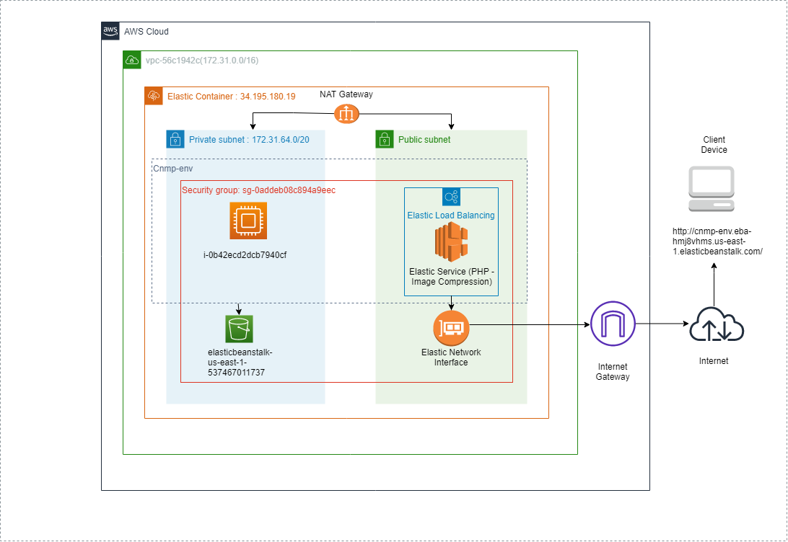

# Scalable Image Compression and resizing using PHP based API and Amazon Web Service
 Image compression is a way to optimize images to reduce their file size, ideally without reducing image quality. In this project, we have come up with a Scalable custom API based WebApp hosted on AWS Elastic Beanstalk, which can be used to compress and resize images with the parameters give such as quality, height and width. To improve the scalability we use Subnetting, VPC and load balancers for different services within the API based Service. 
## Features

- Image compression with resizing
- API based | parameters : quality, height, width
- Scalable AWS Based
- Simple and easy to use

  
## API Reference 

#### Compression 

```http
  GET /endpoint.php?image=?&quality=?
```


| Parameter | Type     | Description                | 
| :-------- | :------- | :------------------------- |
| `image` | `image` | **Required**. The image to be compressed |
| `Quality` | `int` | **Required**. Quality of the compression(range:1 to 100) |


#### Resizing

```http
  GET /endpoint.php?image=?&height=?&width=?
```

| Parameter | Type     | Description                       |
| :-------- | :------- | :-------------------------------- |
| `image`      | `image` | **Required**. IThe image to be compressed |
| `height`      | `int` | **Required**. Height of the resized image |
| `width`      | `int` | **Required**. width of the resized image |


## AWS Architecture

We have used the following cloud architecture to configure the image compression service in the AWS Clound environment 




#### Configuration :
```bash
  1. Configure a virtual private cloud (VPC) and create a EC2 instance running Linux 
  2. Run the PHP Environment on the EC2 Instance using elastic beanstalk.
  3. Configure the S3 bucket in the same security group as the EC2 instance to store the images recieved
     by the API for further processes in a private subnet.
  4. Connect the private subnet to the public subnet using a NAT gateway
  5. Add elastic load balancing to the elastic environment and connect it to the 
     public elastic IP using an Internet Gateway
```

  
## Demo


## Appendix

This is done using PHP and can be tested with the hosted version on my personal server : http://floodanalyser.com/flamapp/flam.php


This form sends a post request with the following parameters (Image, quality, height and width). If height and width are not specified the quality is reduced as per the parameter inputted. If quality and the hxw are provided, the image is compressed and resized.

This creates a token based on the timestamp and appends it with every image uploaded so there are no clashes with other service requests with the same name. We also can use the temporary image path provided from the local device but it's vulnerable to change with refresh or no activity. I have also included a statement at the end of compression which shows its original size vs compressed size

Certain test cases such as the quality cannot be less than 0 or higher than 100, or the file not being uploaded and other basic test cases have been checked and tested


  
